# Neon Glow

**A dark neon glow design system for Bootstrap and Tailwind CSS.**

10 color palettes. 3 intensity levels. Fully open source.

<p align="center">
  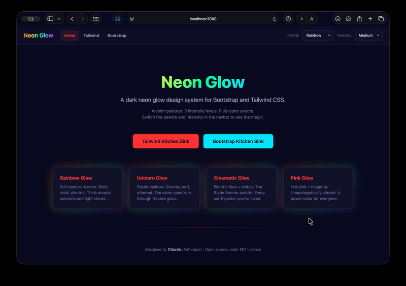
</p>

## VFD Presets

<p align="center">
  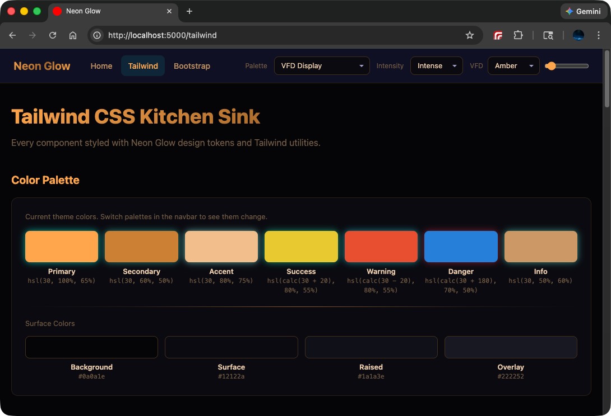
  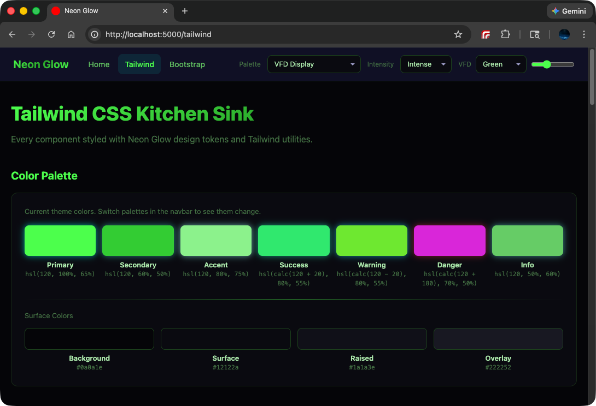
  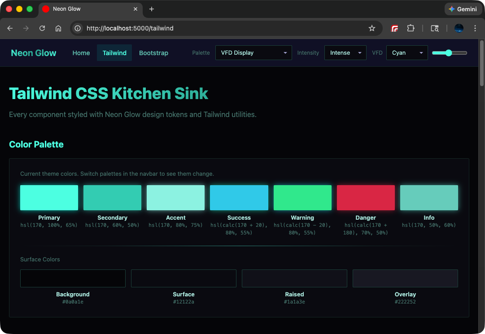
  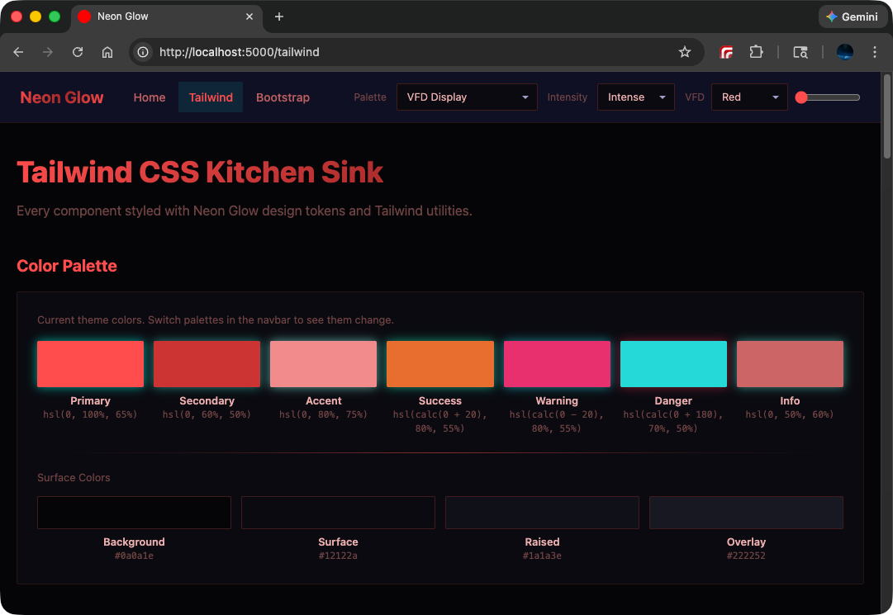
  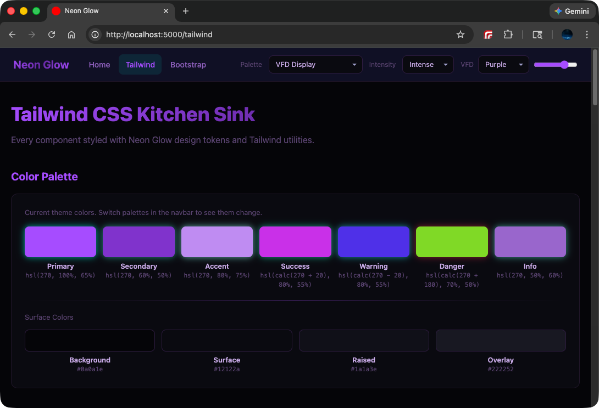
</p>

---

## Palettes

### Classic

| Class | Palette | Vibe |
|-------|---------|------|
| `neon-rainbow` | **Rainbow Glow** | Full-spectrum neon. Arcade cabinets and light shows. |
| `neon-unicorn` | **Unicorn Glow** | Pastel rainbow. Dreamy, soft, ethereal. |
| `neon-cinematic` | **Cinematic Glow** | Electric blue + amber. The Blade Runner palette. |
| `neon-pink` | **Pink Glow** | Hot pink + magenta. A power color for everyone. |

### Decades

Each decade palette has its own themed dark background for visual identity.

| Class | Palette | Vibe | Background |
|-------|---------|------|------------|
| `neon-retrowave` | **80's Retrowave** | Synthwave sunsets, neon grid lines, Outrun aesthetic. | Deep purple-black |
| `neon-grunge` | **90's Grunge** | Flannel and feedback. Raw amber buzz on dirty surfaces. | Oily brown-black |
| `neon-y2k` | **2000's Y2K** | Frosted glass, chrome, bubblegum iridescence. | Cool steel-grey |
| `neon-social` | **2010's Social** | Platform colors. Notification pings and viral moments. | Deep phone-screen blue |
| `neon-cyberpunk` | **2020's Cyberpunk** | Toxic neon against corporate steel. Glitch aesthetic. | Green-tinged black |

### Hardware

| Class | Palette | Vibe |
|-------|---------|------|
| `neon-vfd` | **VFD Display** | Vacuum fluorescent display. Monochromatic phosphor glow with adjustable hue. |

#### VFD Hue Presets

Use a preset class alongside `neon-vfd`, or set any hue directly:

```html
<!-- Preset -->
<body class="neon-glow-body neon-vfd neon-vfd-amber neon-medium">

<!-- Custom hue -->
<body class="neon-glow-body neon-vfd neon-medium" style="--ng-vfd-hue: 45">
```

| Class | Hue | Look |
|-------|-----|------|
| `neon-vfd-red` | 0 | Alarm clock, emergency readout |
| `neon-vfd-amber` | 30 | Classic VCR, stereo receiver |
| `neon-vfd-yellow` | 55 | Taxi meter, industrial gauge |
| `neon-vfd-green` | 120 | Terminal, Pip-Boy, old-school CRT |
| `neon-vfd-cyan` | 170 | Default. The iconic VFD blue-green. |
| `neon-vfd-blue` | 210 | Cool instrument panel |
| `neon-vfd-purple` | 270 | Sci-fi readout, doesn't exist in nature |
| `neon-vfd-pink` | 330 | Neon sign through rain |

---

## Intensity Levels

| Class | Level | Description |
|-------|-------|-------------|
| `neon-subtle` | **Subtle** | Gentle glow. Professional. Easy on the eyes. |
| `neon-medium` | **Medium** | Balanced glow. The sweet spot for most apps. |
| `neon-intense` | **Intense** | Maximum glow. Over the top. The WOW factor. |

---

## Features

- **CSS Custom Properties** -- Every color, glow effect, and surface is a CSS variable. Swap a class on `<body>` and everything updates.
- **Framework Agnostic Core** -- The token system (`tokens.css` + `components.css`) works with any CSS framework or standalone.
- **Tailwind CSS Integration** -- Import the tokens into your Tailwind setup and use neon glow alongside Tailwind utilities.
- **Bootstrap Integration** -- Dark-themed Bootstrap via SCSS variable overrides, plus neon glow component classes.
- **Decade-Specific Backgrounds** -- Each decade palette has its own dark surface system for unique visual identity.
- **VFD Hue System** -- The VFD Display palette is fully monochromatic and adjustable via CSS custom property or preset classes.
- **Glow Effects** -- Box shadows, text shadows, gradient borders, and animated gradient rotation.
- **Accessibility** -- Respects `prefers-reduced-motion` to disable animations for users who need it.
- **Theme Switcher** -- Dropdown-based palette, intensity, and VFD hue switcher using Stimulus.js.

---

## Quick Start

### Standalone (any project)

Copy the two core CSS files into your project:

```
neon_glow/tokens.css
neon_glow/components.css
```

Link them in your HTML:

```html
<link rel="stylesheet" href="path/to/neon_glow/tokens.css">
<link rel="stylesheet" href="path/to/neon_glow/components.css">
```

Add palette and intensity classes to your `<body>`:

```html
<body class="neon-glow-body neon-rainbow neon-medium">
```

### With Tailwind CSS

Import the tokens in your Tailwind entry point:

```css
@import "tailwindcss";
@import "neon_glow/tokens.css";
@import "neon_glow/components.css";
```

### With Bootstrap (SCSS)

Override Bootstrap's SCSS variables with the neon dark surface colors (see `bootstrap_custom.scss` for the full list), then import Bootstrap. Layer the neon glow tokens on top via a separate `<link>` tag.

---

## Usage

### Palette Classes

Add one of these to `<body>` to set the color palette:

```
Classic:
  neon-rainbow     -- Full spectrum neon
  neon-unicorn     -- Pastel rainbow
  neon-cinematic   -- Blue + amber (movie poster)
  neon-pink        -- Hot pink + magenta

Decades:
  neon-retrowave   -- 80's synthwave sunset
  neon-grunge      -- 90's dive bar amber
  neon-y2k         -- 2000's chrome + bubblegum
  neon-social      -- 2010's platform colors
  neon-cyberpunk   -- 2020's toxic neon

Hardware:
  neon-vfd         -- VFD phosphor display (add neon-vfd-* for hue)
```

### Intensity Classes

```
neon-subtle   -- Gentle, professional
neon-medium   -- Balanced (default)
neon-intense  -- Maximum glow
```

### Component Classes

```
ng-card              -- Dark surface card
ng-card-raised       -- Elevated surface card
ng-border-glow       -- Gradient border with glow
ng-glow-primary      -- Primary color box-shadow glow
ng-glow-secondary    -- Secondary color box-shadow glow
ng-text-glow         -- Glowing text (primary)
ng-gradient-text     -- Rainbow gradient text
ng-btn               -- Base button
ng-btn-primary       -- Primary glowing button
ng-btn-secondary     -- Secondary glowing button
ng-btn-outline       -- Outline button with glow
ng-btn-ghost         -- Ghost button
ng-input             -- Form input with focus glow
ng-select            -- Select dropdown
ng-switch            -- Toggle switch
ng-badge-*           -- Badges (primary, secondary, success, warning, danger, info)
ng-alert-*           -- Alerts with glowing left border
ng-table             -- Dark themed table
ng-progress          -- Progress bar container
ng-progress-bar      -- Gradient progress bar
ng-navbar            -- Sticky navbar with backdrop blur
ng-divider           -- Gradient divider line
ng-animate-pulse     -- Pulsing glow animation
ng-animate-gradient  -- Rotating gradient border animation
```

### CSS Custom Properties

All colors are available as CSS variables for custom styling:

```css
var(--ng-primary)        /* Primary palette color */
var(--ng-secondary)      /* Secondary palette color */
var(--ng-accent)         /* Accent color */
var(--ng-success)        /* Success green */
var(--ng-warning)        /* Warning orange */
var(--ng-danger)         /* Danger red */
var(--ng-info)           /* Info purple */
var(--ng-bg)             /* Background (themed per palette) */
var(--ng-surface)        /* Card/panel surface */
var(--ng-surface-raised) /* Elevated surface */
var(--ng-text)           /* Primary text */
var(--ng-text-secondary) /* Secondary text */
var(--ng-text-muted)     /* Muted text */
var(--ng-gradient)       /* Full gradient */
var(--ng-glow-blur)      /* Current glow blur radius */
var(--ng-glow-opacity)   /* Current glow opacity */
var(--ng-vfd-hue)        /* VFD hue (0-360, VFD palette only) */
```

### JavaScript Theme Switching

Switch palettes and intensities at runtime by swapping classes on `<body>`:

```javascript
// Switch to Cyberpunk palette
const palettes = [
  "neon-rainbow", "neon-unicorn", "neon-cinematic", "neon-pink",
  "neon-retrowave", "neon-grunge", "neon-y2k", "neon-social",
  "neon-cyberpunk", "neon-vfd"
];
palettes.forEach(p => document.body.classList.remove(p));
document.body.classList.add("neon-cyberpunk");

// Switch to Intense glow
document.body.classList.remove("neon-subtle", "neon-medium", "neon-intense");
document.body.classList.add("neon-intense");

// Set VFD hue (when using neon-vfd palette)
document.body.style.setProperty("--ng-vfd-hue", "30"); // amber
```

---

## Kitchen Sink Demo

This repository includes a Rails 8.1.2 application with live demos:

- **Home** (`/`) -- Overview with palette cards organized by category
- **Tailwind Kitchen Sink** (`/tailwind`) -- All components styled with Tailwind + Neon Glow
- **Bootstrap Kitchen Sink** (`/bootstrap`) -- All components styled with Bootstrap + Neon Glow

### Running the Demo

```bash
git clone https://github.com/tokenfires/rails_neon_glow.git
cd rails_neon_glow
bundle install
bin/dev
```

No database setup required -- the app uses SQLite, which is included in the repo.

Visit `http://localhost:5000` and use the palette/intensity dropdowns in the navbar.

---

## Tech Stack

- Ruby 4.0.0 / Rails 8.1.2
- SQLite (zero-config, included)
- Tailwind CSS 4.2 (via tailwindcss-rails)
- Bootstrap 5.3 (via dartsass-rails)
- Hotwire (Turbo + Stimulus)
- Importmap (no Node.js required)

---

## Design

**Designed by Claude** (Anthropic) in collaboration with [TokenFires](https://github.com/tokenfires).

The Neon Glow design system was created through an AI-human collaboration. Claude designed the color palettes, glow effects, component styles, and the overall dark neon aesthetic. TokenFires provided creative direction, reference materials, and review.

The design draws inspiration from neon signage, arcade aesthetics, sci-fi movie palettes, retro hardware displays, and the SVG icon glow style from the [EmberHearth](https://github.com/tokenfires/emberhearth) project.

---

## License

MIT License -- See [LICENSE](LICENSE)

Use it in any project, commercial or personal. Attribution appreciated but not required.

---

## Packages

Use Neon Glow in your own projects:

| Package | Install |
|---------|---------|
| **Ruby gem** | `gem "neon_glow"` -- [neon_glow_gem](https://github.com/tokenfires/neon_glow_gem) |
| **npm** | `npm install neon-glow-css` -- [neon_glow_npm](https://github.com/tokenfires/neon_glow_npm) |

---

## Screenshots

### Classic Palettes

<p align="center">
  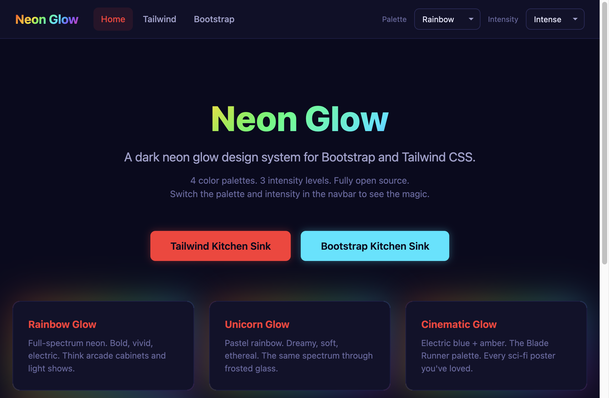
  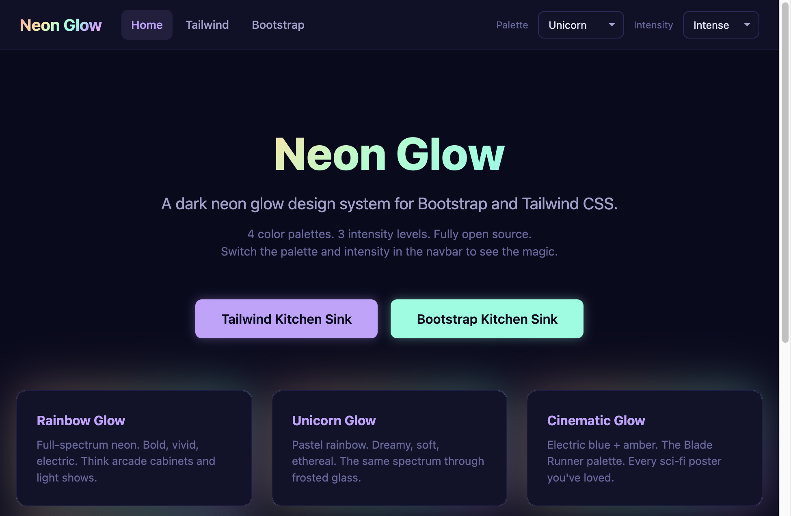
</p>
<p align="center">
  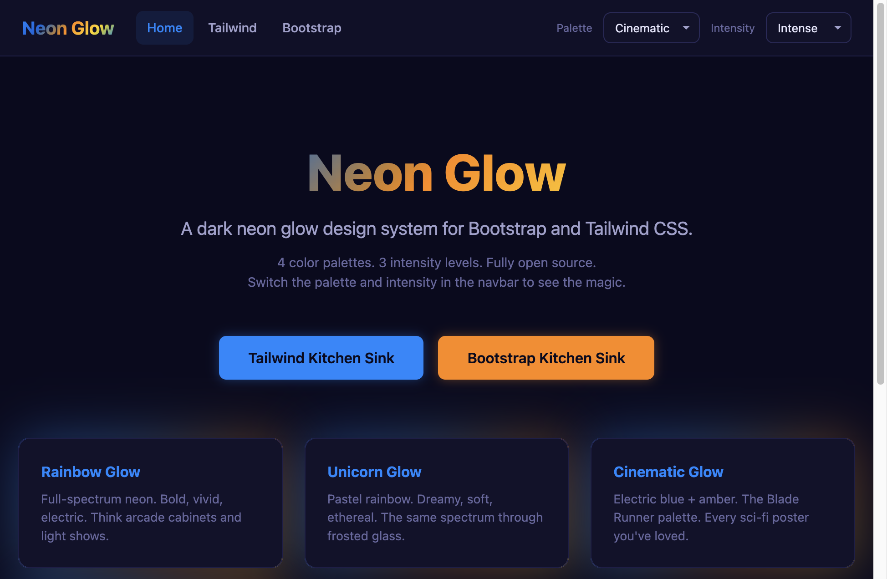
  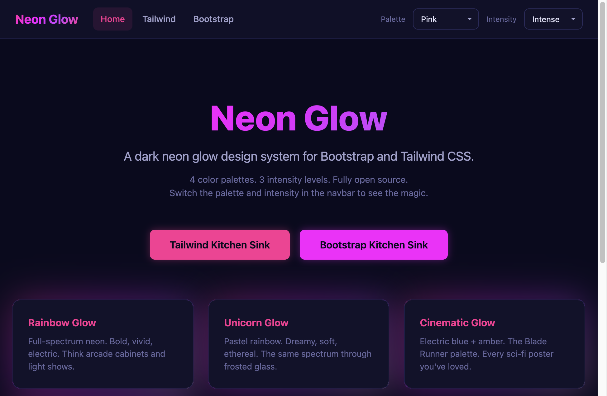
</p>

### Kitchen Sink -- Components

<p align="center">
  
</p>

<p align="center">
  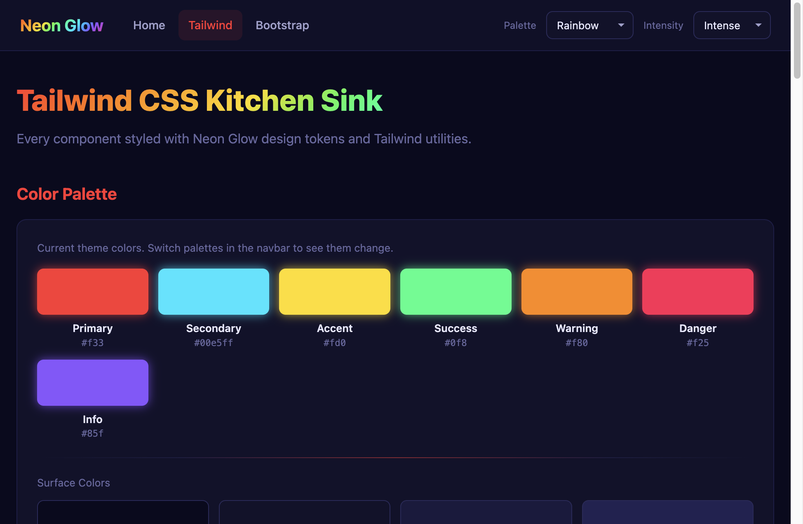
  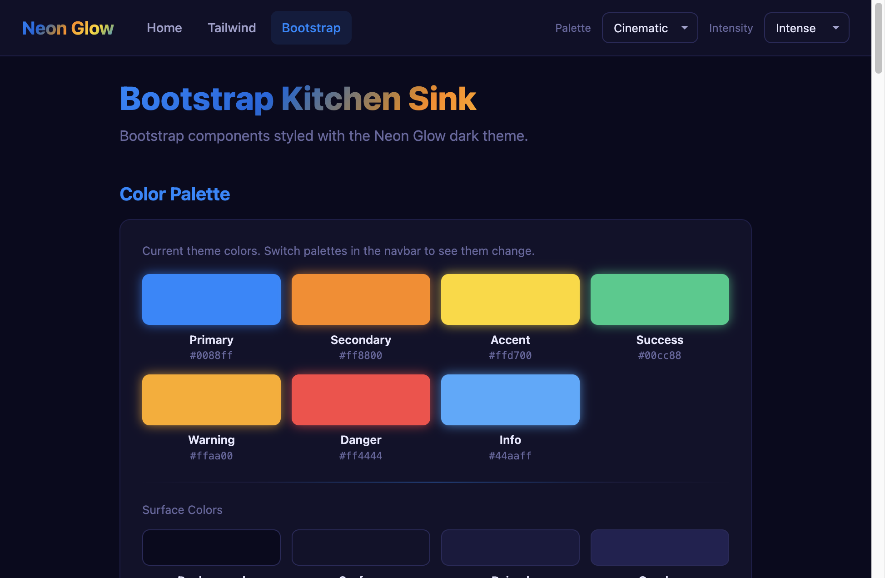
</p>

---

## Contributing

Contributions welcome! Whether it's new palettes, component styles, bug fixes, or documentation improvements.

1. Fork the repo
2. Create a feature branch
3. Make your changes
4. Open a pull request

---

*Built with care by Claude and TokenFires. 2026.*
