# Neon Glow

**A dark neon glow design system for Bootstrap and Tailwind CSS.**

12 color palettes. 4 intensity levels. 3 typography slots. Fully open source.

<p align="center">
  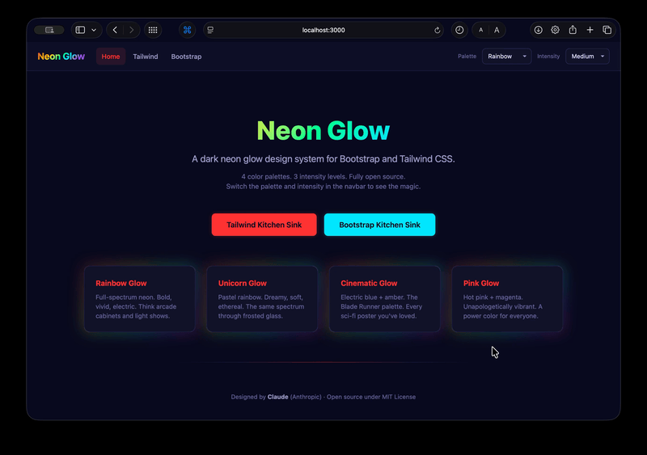
</p>

## VFD Presets

<p align="center">
  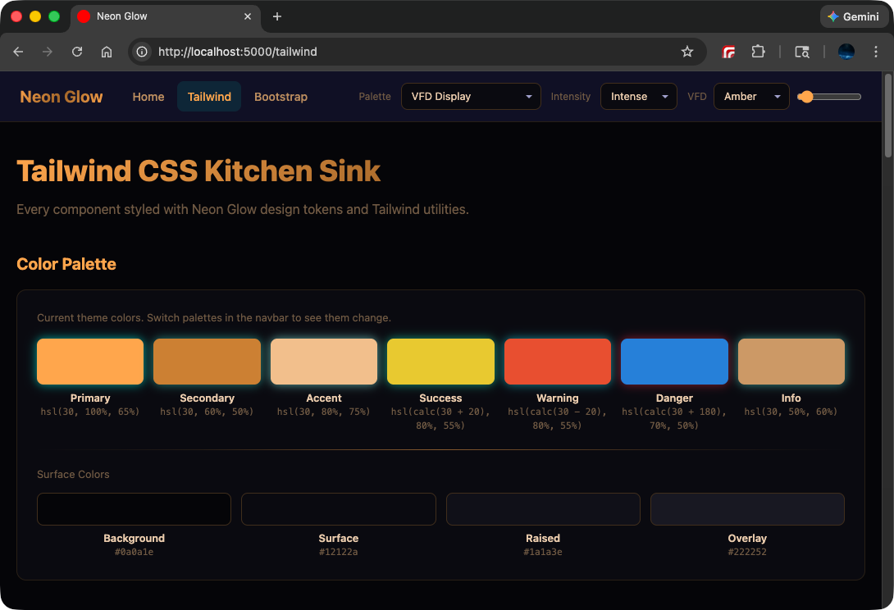
  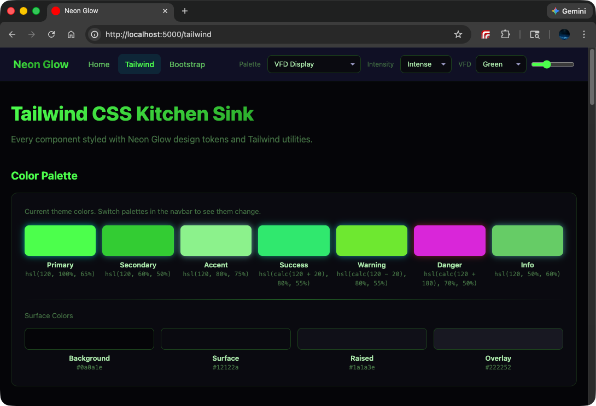
  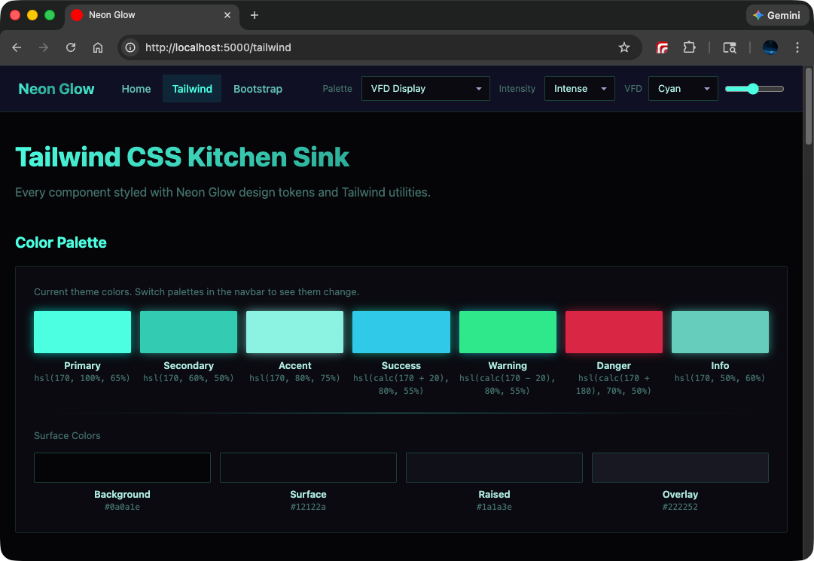
  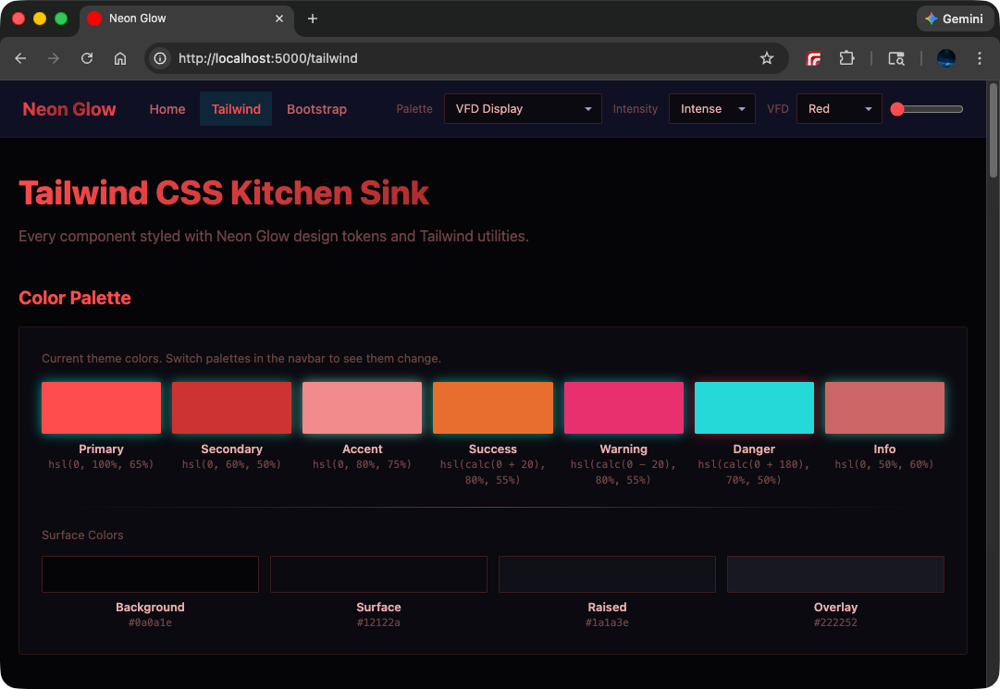
  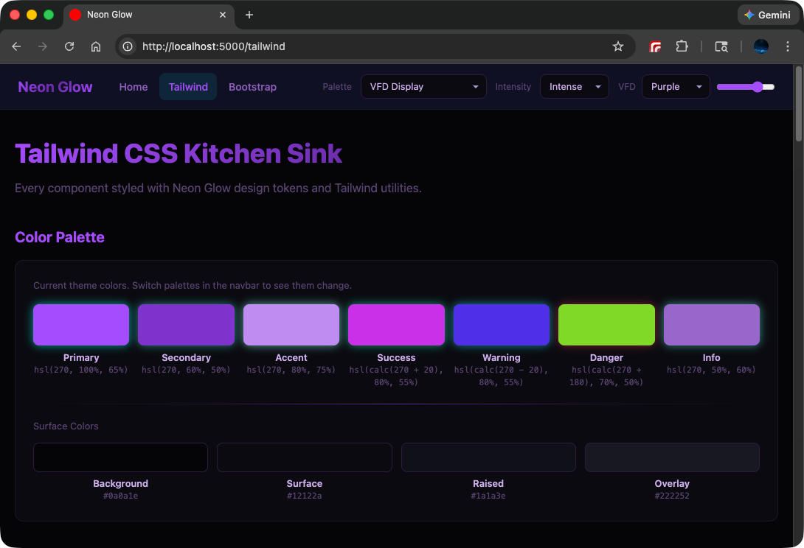
</p>

---

## Palettes

### Classic

| Class | Palette | Vibe |
|-------|---------|------|
| `neon-rainbow` | **Rainbow Glow** | Full-spectrum neon. Arcade cabinets and light shows. |
| `neon-unicorn` | **Unicorn Glow** | Pastel rainbow. Dreamy, soft, ethereal. |
| `neon-cinematic` | **Cinematic Glow** | Electric blue + amber. The Blade Runner palette. |
| `neon-pink` | **Pink Glow** | Hot pink + magenta. A power color for everyone. |

### Decades

Each decade palette has its own themed dark background for visual identity.

| Class | Palette | Vibe | Background |
|-------|---------|------|------------|
| `neon-retrowave` | **80's Retrowave** | Synthwave sunsets, neon grid lines, Outrun aesthetic. | Deep purple-black |
| `neon-grunge` | **90's Grunge** | Flannel and feedback. Raw amber buzz on dirty surfaces. | Oily brown-black |
| `neon-y2k` | **2000's Y2K** | Frosted glass, chrome, bubblegum iridescence. | Cool steel-grey |
| `neon-social` | **2010's Social** | Platform colors. Notification pings and viral moments. | Deep phone-screen blue |
| `neon-cyberpunk` | **2020's Cyberpunk** | Toxic neon against corporate steel. Glitch aesthetic. | Green-tinged black |

### Hardware

| Class | Palette | Vibe |
|-------|---------|------|
| `neon-vfd` | **VFD Display** | Vacuum fluorescent display. Monochromatic phosphor glow with adjustable hue. |
| `neon-cherenkov` | **Cherenkov** | Reactor pool blue. The deep ghostly glow of charged particles exceeding the phase velocity of light in water. |
| `neon-nixie` | **Nixie** | Warm amber-orange gas-discharge glow of a 1950s-60s instrument tube. Mercury-violet fringe at the base. |

#### VFD Hue Presets

Use a preset class alongside `neon-vfd`, or set any hue directly:

```html
<!-- Preset -->
<body class="neon-glow-body neon-vfd neon-vfd-amber neon-medium">

<!-- Custom hue -->
<body class="neon-glow-body neon-vfd neon-medium" style="--ng-vfd-hue: 45">
```

| Class | Hue | Look |
|-------|-----|------|
| `neon-vfd-red` | 0 | Alarm clock, emergency readout |
| `neon-vfd-amber` | 30 | Classic VCR, stereo receiver |
| `neon-vfd-yellow` | 55 | Taxi meter, industrial gauge |
| `neon-vfd-green` | 120 | Terminal, Pip-Boy, old-school CRT |
| `neon-vfd-cyan` | 170 | Default. The iconic VFD blue-green. |
| `neon-vfd-blue` | 210 | Cool instrument panel |
| `neon-vfd-purple` | 270 | Sci-fi readout, doesn't exist in nature |
| `neon-vfd-pink` | 330 | Neon sign through rain |

---

## Intensity Levels

| Class | Level | Description |
|-------|-------|-------------|
| `neon-subtle` | **Subtle** | Gentle glow. Professional. Easy on the eyes. |
| `neon-medium` | **Medium** | Balanced glow. The sweet spot for most apps. |
| `neon-intense` | **Intense** | Strong glow. Over the top. The WOW factor. |
| `neon-overdrive` | **Overdrive** | Maximum bloom. Light pushing past normal operating range. The streetlamp-at-night register. |

### Per-theme defaults

Each palette has a default intensity that lands its visual identity on first impression. Selecting a palette in the demo automatically applies its default; you can still manually override the intensity afterward.

| Palette | Default Intensity | Why |
|---------|-------------------|-----|
| `neon-rainbow` | Medium | Full-spectrum color is already loud; intensity shouldn't compound |
| `neon-unicorn` | Intense | Dreamy fantasy register; pastels at intense produce ethereal rather than washed |
| `neon-cinematic` | Intense | Blade Runner doesn't apologize |
| `neon-pink` | Medium | Magenta is already assertive; medium keeps it feminine-assertive |
| `neon-retrowave` | Intense | 80s synthwave was designed loud |
| `neon-grunge` | Intense | Raw feedback aesthetic; dial it up |
| `neon-y2k` | Medium | Boy-band glossy-clean; smearing breaks the polish |
| `neon-social` | Subtle | Modern corporate UI; calmness is the aesthetic |
| `neon-cyberpunk` | Overdrive | Toxic dystopian neon; system saturation is the point |
| `neon-vfd` | Medium | Instrument display readability |
| `neon-cherenkov` | Overdrive | Reactor-pool bloom needs the extra spread |
| `neon-nixie` | Intense | Modern nostalgic-recreation register |

---

## Typography

`neon_glow` defines three primary font slots as CSS custom properties, plus an optional fourth for themes that layer multiple display voices:

| Token | Default | Role |
|-------|---------|------|
| `--ng-font-display` | `Inter` | Headlines, hero text, display elements |
| `--ng-font-body` | `Inter` | Paragraphs, body content, unstyled text |
| `--ng-font-mono` | `JetBrains Mono` | Code, pre-formatted text, keyboard input |
| `--ng-font-display-alt` | `var(--ng-font-display)` | Optional secondary display face for subheads; used by some themes to layer multiple display voices |

Fonts are delivered via Google Fonts `@import` at the top of `tokens.css`. All included fonts are OFL-licensed and free for commercial use.

### Per-theme font overrides

Each palette with a strong era or hardware referent gets a display font tuned to that referent. Body type stays `Inter` across most palettes for consistent reading.

| Palette | Display font | Why |
|---------|--------------|-----|
| **Retrowave** | `Orbitron` | Wide geometric sci-fi sans — 80s synthwave / Blade Runner title cards |
| **Y2K** | `Syncopate` | Wide tall sans — early-2000s chrome and frosted glass |
| **Cyberpunk** | `Rubik Glitch` | Geometric sans with visible data-corruption artifacts baked into the glyphs — type that IS broken, not type that depicts broken-ness |
| **VFD** | `VT323` | Pixel terminal typeface — matches the vacuum-fluorescent segmented-display referent |
| **Grunge** | `Special Elite` | Typewriter-photocopy face — 90s zine, dive-bar flyer, hand-typed feedback loop |
| **Social** | native system stack (display + body) | Platform-native 2010s ethos — your device picks the font, which IS the referent |
| **Cherenkov** | `Space Grotesk` | Clean technical humanist sans — modern scientific instrument typography |
| **Nixie** | `B612 Mono` (display + body) + `Montserrat Underline` (h1/h2 in `.ng-card`) | Airbus cockpit-display font for the instrument-readout register; underline font composes into wire-grid tube cells |

Classic palettes (Rainbow, Unicorn, Cinematic, Pink) stay on `Inter` — they're abstract color stories without era/object referents, and a custom font would feel imposed.

Additional per-theme overrides land in later batches of Phase 3.

### Using custom fonts

Override the tokens in your own CSS:

```css
:root {
  --ng-font-display: 'Your Custom Font', sans-serif;
  --ng-font-body:    'Your Body Font', serif;
  --ng-font-mono:    'Your Mono Font', monospace;
}
```

You can also override per-theme by scoping to a palette class:

```css
.neon-cyberpunk {
  --ng-font-display: 'Orbitron', sans-serif;
}
```

### The Nixie wire-grid frame

The `.ng-nixie-digit` utility class applies a cathode-wire-and-bracket frame behind its contents, recreating the visual of a lit Nixie tube's cathode stack. Auto-applied to card `h1` and `h2` headings inside the `.neon-nixie` palette. You can apply it manually to any element:

```html
<span class="ng-nixie-digit">42</span>
```

### The neon tube affordance

The `.ng-neon-tube` utility makes any element read as literal neon signage. It applies the `Megrim` font — a constructivist display face whose thin geometric letterforms are built from single-line strokes the way physical neon signs are: lengths of glass tubing bent into letter shapes. Each letter IS a tube. Color follows the active palette's primary, so the same element renders as a differently-colored tube under each palette.

The utility is identical under every palette — no per-palette overrides, no palette-specific decoration. Nixie's signature treatments (wire-grid frame, Montserrat Underline) stay on Nixie's own scopes (`.ng-card h1`/`h2` and the `.ng-nixie-digit` numerals demo); the tube utility itself is the same wherever you drop it.

```html
<h1 class="ng-neon-tube">Neon Glow</h1>
```

The demo kitchen sinks (Bootstrap and Tailwind) and the home page hero all use this utility — switch palettes in the navbar to see the same sign relight in twelve different registers:

- **Retrowave** — hot magenta tube
- **Cyberpunk** — toxic green tube
- **Cinematic** — amber Blade Runner title-card tube
- **Cherenkov** — deep reactor-pool blue tube
- **Nixie** — amber tube with the per-character wire-grid applied automatically (the only palette that layers the wire-grid on top of the tube; on other palettes the tube stands alone)

Unlike `.ng-nixie-digit`, which is Nixie-only, `.ng-neon-tube` works under every palette. This is what makes the "neon glow" brand claim structural, not just color-based.

### Hardware Chrome (VFD instrument panel)

The VFD Display palette auto-applies instrument-panel chrome to every `.ng-card` — hard-edged bezels, recessed inset shadows, and zero border radius. Cards snap from soft rounded rectangles to 1970s-80s Pioneer stereo readout panels when VFD is selected. No classes to add; just switching the palette does it.

Add `data-vfd-label="DISPLAY"` (or any string) to an `.ng-card` to get a tiny monospace label silk-screened in the top-left corner, like the "TREBLE" / "BASS" / "VOL" labels on real audio components. Only renders under VFD; other palettes ignore the attribute.

The underlying primitives are palette-agnostic utilities you can use on any palette:

```
ng-instrument-frame  -- Hard-edged bezel with recessed inset shadow
ng-chamfer           -- 45° clipped corners via clip-path
ng-vfd-separator     -- Hairline horizontal rule
ng-vfd-label         -- Tiny all-caps mono label
ng-vu-segment        -- Trapezoidal fan-out segment (VU meter style)
```

---

## Features

- **CSS Custom Properties** -- Every color, glow effect, and surface is a CSS variable. Swap a class on `<body>` and everything updates.
- **Framework Agnostic Core** -- The token system (`tokens.css` + `components.css`) works with any CSS framework or standalone.
- **Tailwind CSS Integration** -- Import the tokens into your Tailwind setup and use neon glow alongside Tailwind utilities.
- **Bootstrap Integration** -- Dark-themed Bootstrap via SCSS variable overrides, plus neon glow component classes.
- **Decade-Specific Backgrounds** -- Each decade palette has its own dark surface system for unique visual identity.
- **VFD Hue System** -- The VFD Display palette is fully monochromatic and adjustable via CSS custom property or preset classes.
- **Glow Effects** -- Box shadows, text shadows, gradient borders, and animated gradient rotation.
- **Accessibility** -- Respects `prefers-reduced-motion` to disable animations for users who need it.
- **Theme Switcher** -- Dropdown-based palette, intensity, and VFD hue switcher using Stimulus.js.

---

## Quick Start

### Standalone (any project)

Copy the two core CSS files into your project:

```
neon_glow/tokens.css
neon_glow/components.css
```

Link them in your HTML:

```html
<link rel="stylesheet" href="path/to/neon_glow/tokens.css">
<link rel="stylesheet" href="path/to/neon_glow/components.css">
```

Add palette and intensity classes to your `<body>`:

```html
<body class="neon-glow-body neon-rainbow neon-medium">
```

### With Tailwind CSS

Import the tokens in your Tailwind entry point:

```css
@import "tailwindcss";
@import "neon_glow/tokens.css";
@import "neon_glow/components.css";
```

### Via CDN (no package manager needed)

One line. No npm, no gems, no build step:

```html
<link rel="stylesheet" href="https://unpkg.com/neon-glow-css/css/neon-glow.css">
```

Then just add the body classes:

```html
<body class="neon-glow-body neon-cyberpunk neon-intense">
  <div class="ng-card ng-border-glow">
    <h1 class="ng-gradient-text">Hello, Neon</h1>
    <button class="ng-btn ng-btn-primary">Glow</button>
  </div>
</body>
```

Works with any vanilla HTML/CSS/JS project, static site generators, CodePen, JSFiddle -- anything.

### With Bootstrap (SCSS)

Override Bootstrap's SCSS variables with the neon dark surface colors (see `bootstrap_custom.scss` for the full list), then import Bootstrap. Layer the neon glow tokens on top via a separate `<link>` tag.

---

## Usage

### Palette Classes

Add one of these to `<body>` to set the color palette:

```
Classic:
  neon-rainbow     -- Full spectrum neon
  neon-unicorn     -- Pastel rainbow
  neon-cinematic   -- Blue + amber (movie poster)
  neon-pink        -- Hot pink + magenta

Decades:
  neon-retrowave   -- 80's synthwave sunset
  neon-grunge      -- 90's dive bar amber
  neon-y2k         -- 2000's chrome + bubblegum
  neon-social      -- 2010's platform colors
  neon-cyberpunk   -- 2020's toxic neon

Hardware:
  neon-vfd         -- VFD phosphor display (add neon-vfd-* for hue)
  neon-cherenkov   -- Deep reactor-pool blue (Cherenkov radiation)
  neon-nixie       -- Warm amber-orange gas-discharge tube glow
```

### Intensity Classes

```
neon-subtle    -- Gentle, professional
neon-medium    -- Balanced (default)
neon-intense   -- Strong glow
neon-overdrive -- Maximum bloom; light pushing past normal range
```

### Component Classes

```
ng-card              -- Dark surface card
ng-card-raised       -- Elevated surface card
ng-border-glow       -- Gradient border with glow
ng-glow-primary      -- Primary color box-shadow glow
ng-glow-secondary    -- Secondary color box-shadow glow
ng-text-glow         -- Glowing text (primary)
ng-gradient-text     -- Rainbow gradient text
ng-nixie-digit       -- Nixie cathode wire-grid frame (see Typography section)
ng-neon-tube         -- Neon-signage treatment; picks up palette primary color
ng-instrument-frame  -- Hard-edged instrument-panel bezel (auto-applied under VFD)
ng-chamfer           -- 45° chamfered corners via clip-path
ng-vfd-separator     -- Hairline horizontal rule for instrument panels
ng-vfd-label         -- Tiny all-caps mono label
ng-vu-segment        -- Trapezoidal VU meter segment
ng-btn               -- Base button
ng-btn-primary       -- Primary glowing button
ng-btn-secondary     -- Secondary glowing button
ng-btn-outline       -- Outline button with glow
ng-btn-ghost         -- Ghost button
ng-input             -- Form input with focus glow
ng-select            -- Select dropdown
ng-switch            -- Toggle switch
ng-badge-*           -- Badges (primary, secondary, success, warning, danger, info)
ng-alert-*           -- Alerts with glowing left border
ng-table             -- Dark themed table
ng-progress          -- Progress bar container
ng-progress-bar      -- Gradient progress bar
ng-navbar            -- Sticky navbar with backdrop blur
ng-divider           -- Gradient divider line
ng-animate-pulse     -- Pulsing glow animation
ng-animate-gradient  -- Color-cycling neon border animation
```

### CSS Custom Properties

All colors are available as CSS variables for custom styling:

```css
var(--ng-primary)        /* Primary palette color */
var(--ng-secondary)      /* Secondary palette color */
var(--ng-accent)         /* Accent color */
var(--ng-success)        /* Success green */
var(--ng-warning)        /* Warning orange */
var(--ng-danger)         /* Danger red */
var(--ng-info)           /* Info purple */
var(--ng-bg)             /* Background (themed per palette) */
var(--ng-surface)        /* Card/panel surface */
var(--ng-surface-raised) /* Elevated surface */
var(--ng-text)           /* Primary text */
var(--ng-text-secondary) /* Secondary text */
var(--ng-text-muted)     /* Muted text */
var(--ng-gradient)       /* Full gradient */
var(--ng-glow-blur)      /* Current glow blur radius */
var(--ng-glow-opacity)   /* Current glow opacity */
var(--ng-vfd-hue)        /* VFD hue (0-360, VFD palette only) */
```

### JavaScript Theme Switching

Switch palettes and intensities at runtime by swapping classes on `<body>`:

```javascript
// Switch to Cyberpunk palette
const palettes = [
  "neon-rainbow", "neon-unicorn", "neon-cinematic", "neon-pink",
  "neon-retrowave", "neon-grunge", "neon-y2k", "neon-social",
  "neon-cyberpunk", "neon-vfd", "neon-cherenkov", "neon-nixie"
];
palettes.forEach(p => document.body.classList.remove(p));
document.body.classList.add("neon-cyberpunk");

// Switch to Intense glow
document.body.classList.remove("neon-subtle", "neon-medium", "neon-intense", "neon-overdrive");
document.body.classList.add("neon-intense");

// Set VFD hue (when using neon-vfd palette)
document.body.style.setProperty("--ng-vfd-hue", "30"); // amber
```

---

## Kitchen Sink Demo

This repository includes a Rails 8.1.2 application with live demos:

- **Home** (`/`) -- Overview with palette cards organized by category
- **Tailwind Kitchen Sink** (`/tailwind`) -- All components styled with Tailwind + Neon Glow
- **Bootstrap Kitchen Sink** (`/bootstrap`) -- All components styled with Bootstrap + Neon Glow

### Running the Demo

```bash
git clone https://github.com/tokenfires/rails_neon_glow.git
cd rails_neon_glow
bundle install
bin/dev
```

No database setup required -- the app uses SQLite, which is included in the repo.

Visit `http://localhost:5000` and use the palette/intensity dropdowns in the navbar.

---

## Tech Stack

- Ruby 4.0.0 / Rails 8.1.2
- SQLite (zero-config, included)
- Tailwind CSS 4.2 (via tailwindcss-rails)
- Bootstrap 5.3 (via dartsass-rails)
- Hotwire (Turbo + Stimulus)
- Importmap (no Node.js required)

---

## Design

**Designed by Claude** (Anthropic) in collaboration with [TokenFires](https://github.com/tokenfires).

The Neon Glow design system was created through an AI-human collaboration. Claude designed the color palettes, glow effects, component styles, and the overall dark neon aesthetic. TokenFires provided creative direction, reference materials, and review.

The design draws inspiration from neon signage, arcade aesthetics, sci-fi movie palettes, retro hardware displays, and the SVG icon glow style from the [EmberHearth](https://github.com/tokenfires/emberhearth) project.

---

## License

MIT License -- See [LICENSE](LICENSE)

Use it in any project, commercial or personal. Attribution appreciated but not required.

---

## Packages

Use Neon Glow in your own projects:

| Package | Install |
|---------|---------|
| **Ruby gem** | `gem "neon_glow"` -- [neon_glow_gem](https://github.com/tokenfires/neon_glow_gem) |
| **npm** | `npm install neon-glow-css` -- [neon_glow_npm](https://github.com/tokenfires/neon_glow_npm) |

---

## Screenshots

### Classic Palettes

<p align="center">
  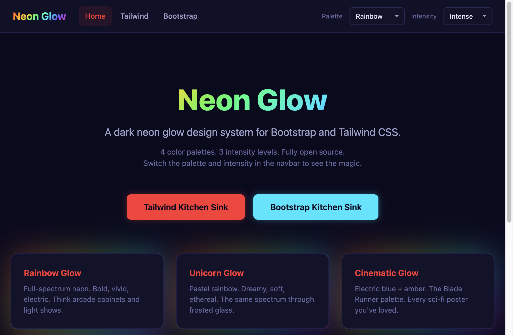
  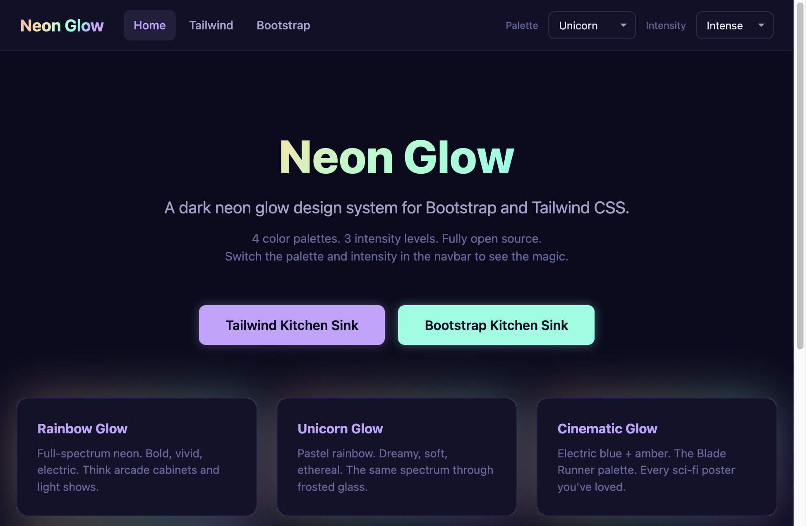
</p>
<p align="center">
  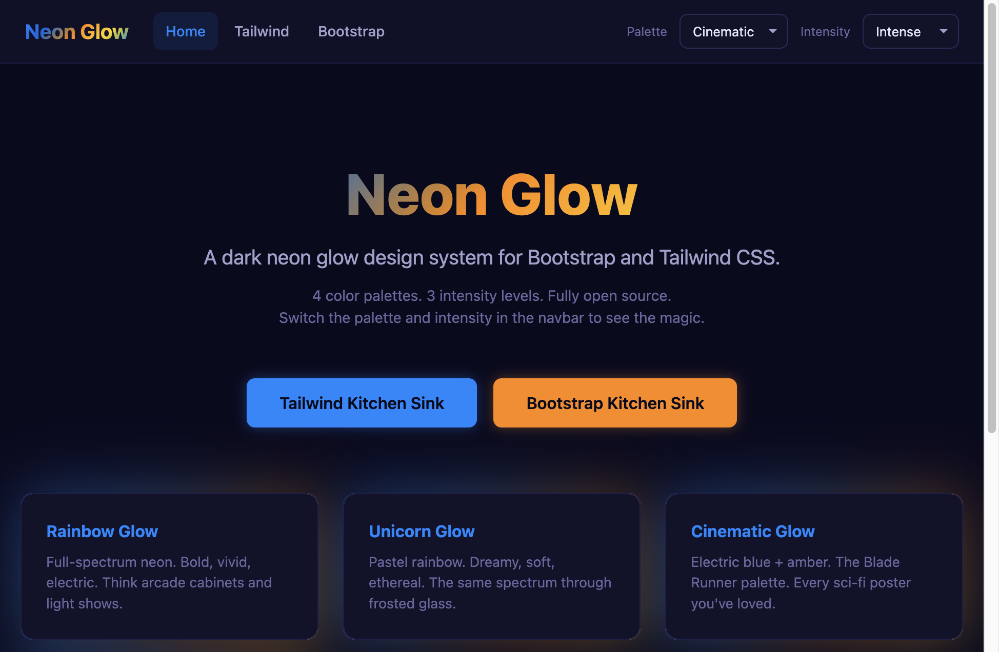
  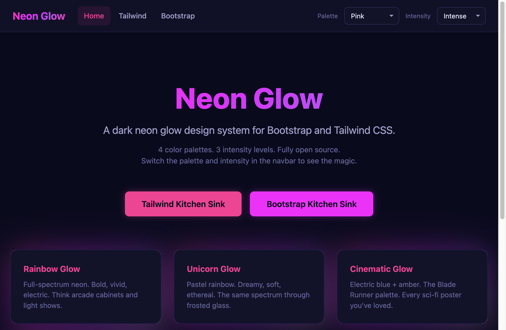
</p>

### Decades

#### 80's Retrowave
<p align="center">
  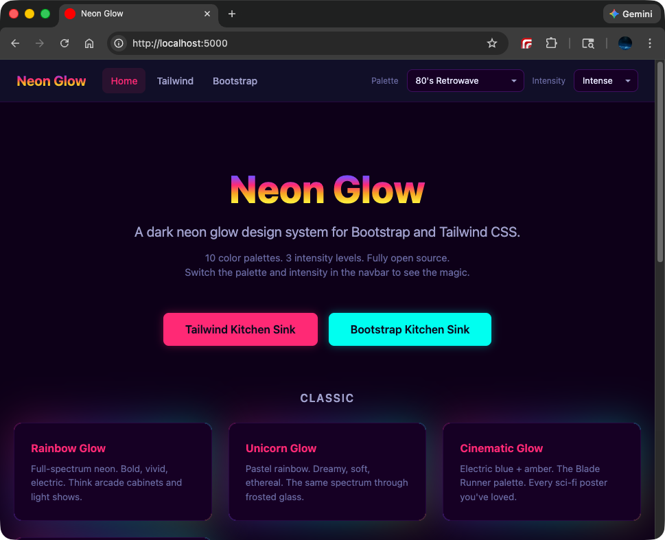
</p>

#### 90's Grunge
<p align="center">
  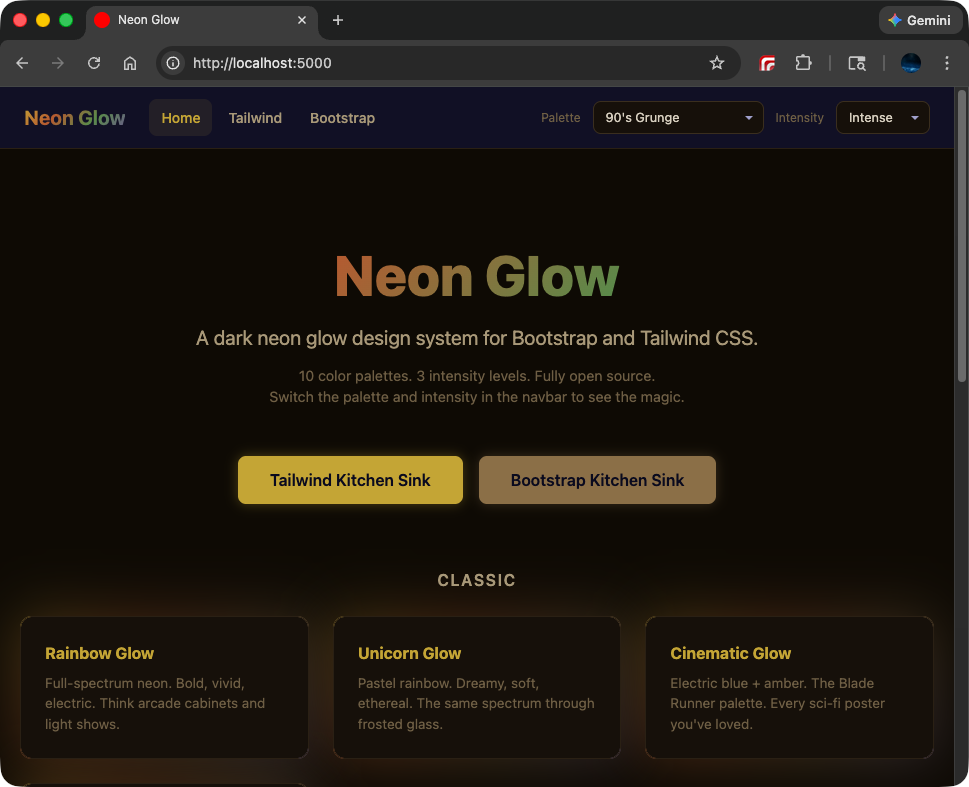
</p>

#### 2000's Y2K
<p align="center">
  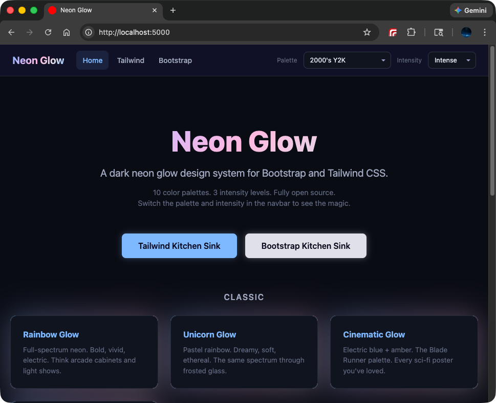
</p>

#### 2010's Social
<p align="center">
  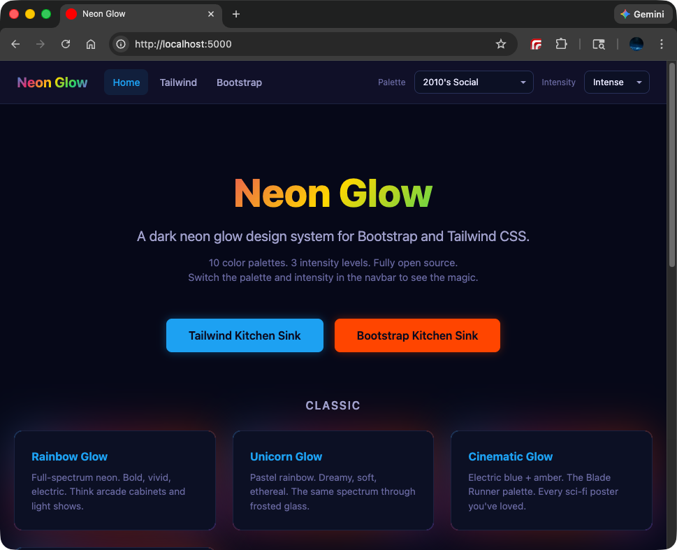
</p>

#### 2020's Cyberpunk
<p align="center">
  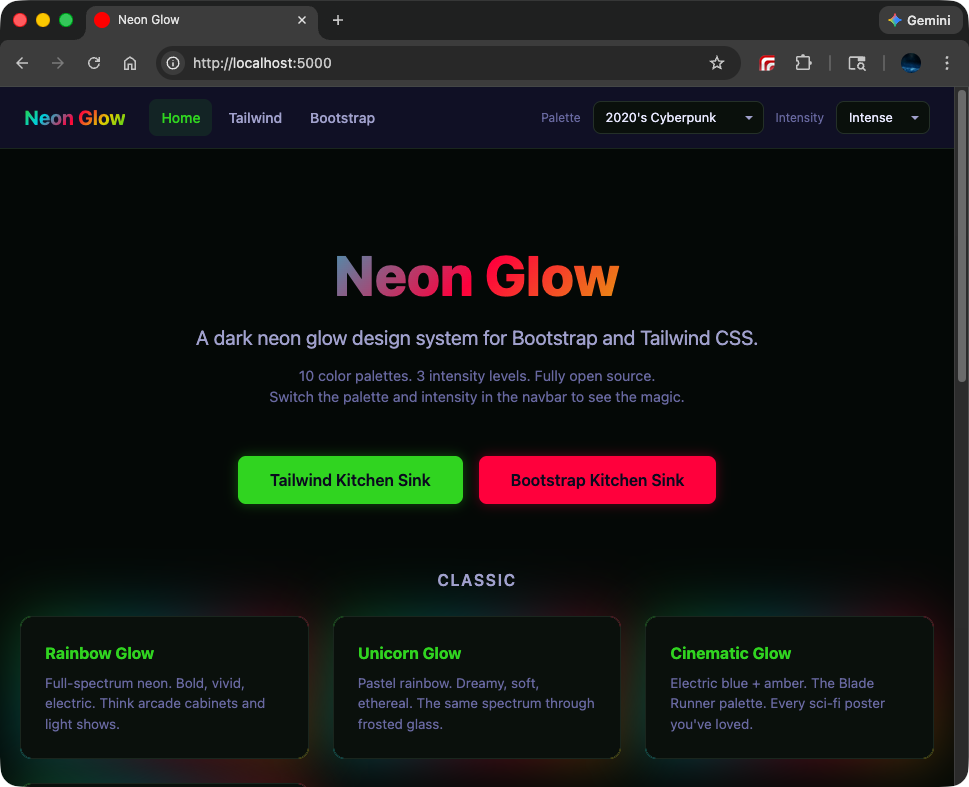
</p>

### Kitchen Sink -- Components

<p align="center">
  
</p>

<p align="center">
  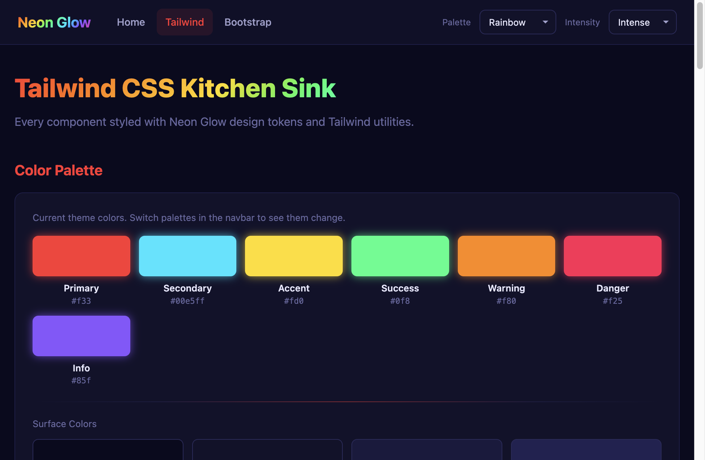
  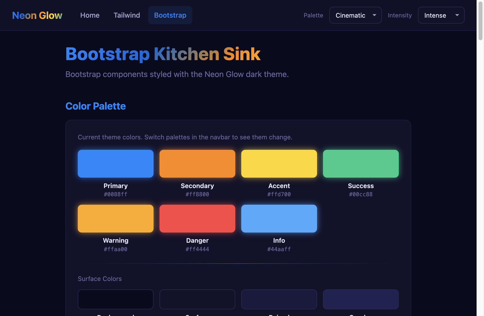
</p>

---

## Contributing

Contributions welcome! Whether it's new palettes, component styles, bug fixes, or documentation improvements.

1. Fork the repo
2. Create a feature branch
3. Make your changes
4. Open a pull request

---

*Built with care by Claude and TokenFires. 2026.*
